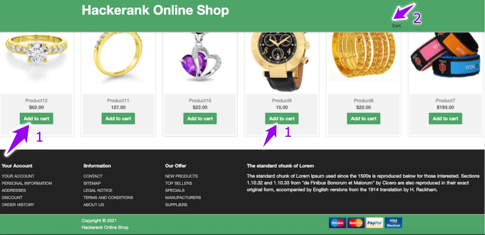
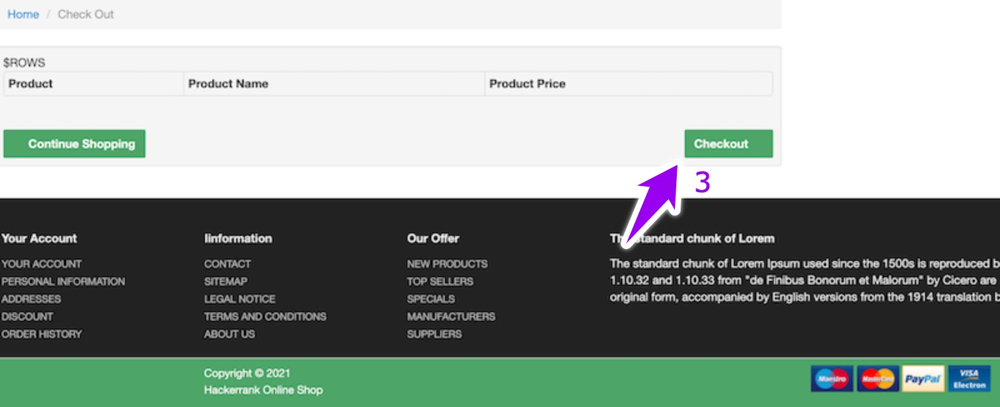

## Environment:
- Java version: 17
- Maven version: 3.*
- Selenium HtmlUnitDriver: 2.52.0

## Read-Only Files:
- src/test/*
- website/*
- src/main/java/com/hackerrank/selenium/server/*

## Requirements:
In this challenge, you are going to use selenium web driver, the HtmlUnitDriver, which uses HtmlUnit headless browser. So you neither need to setup the browsers like Firefox, Chrome nor a web driver executables like FirefoxDriver, ChromeDriver.
You are given a dummy online shopping website which displays product grid with product details. The given project lacks a few implementations and you have to complete the them.

There is a class `ShoppingCart.java` which has 2 methods:
 
`void addProductsToCart(String productsURL, List<String> products, WebDriver driver)`:
  - browser the website `productURL`.
  - go to the given set of products, `products` is the list of name of products.
  - add them to cart.
 
`void checkout(String productsURL, WebDriver driver)`:
  - go to the cart. You will see the list of products in the cart.
  - make checkout with a click on checkout button.
  
  
There is a class `Database.java` which has 3 methods:

Here we are using SQLite database and there is a `init()` method which drops and re-creates `products` table on every run. Also a method to connect to the database is provided. The model class `Product.java` is provided which represents the `products` table.
Example of product data:
| name     | img   | status | price |
|----------|-------|--------|-------|
| Product7 | a.jpg | carted | 33    |


`void insertProduct(Product product)`:
- insert the given `product` into the table `products`.

`List<Product> selectProducts()`:
- fetch all the products from the product table and return them as a list of `Product`.

`void deleteProducts()`:
- delete all the rows from the `products` table.


There are tests for testing correctness of each methods. So you can make use of these tests while debugging/checking your implementation.
The example website is given in the `website` folder where you can view the structure of products page and cart page.

The products page will look like: 



And the checkout page will look like:



Your task is to complete the implementation of those 5 methods so that the unit tests pass while running the tests.

## Commands
- run: 
```bash
mvn clean package && java -jar target/selenium-java-shopping-cart-1.0.jar
```
- install: 
```bash
mvn clean install
```
- test: 
```bash
mvn clean test
```